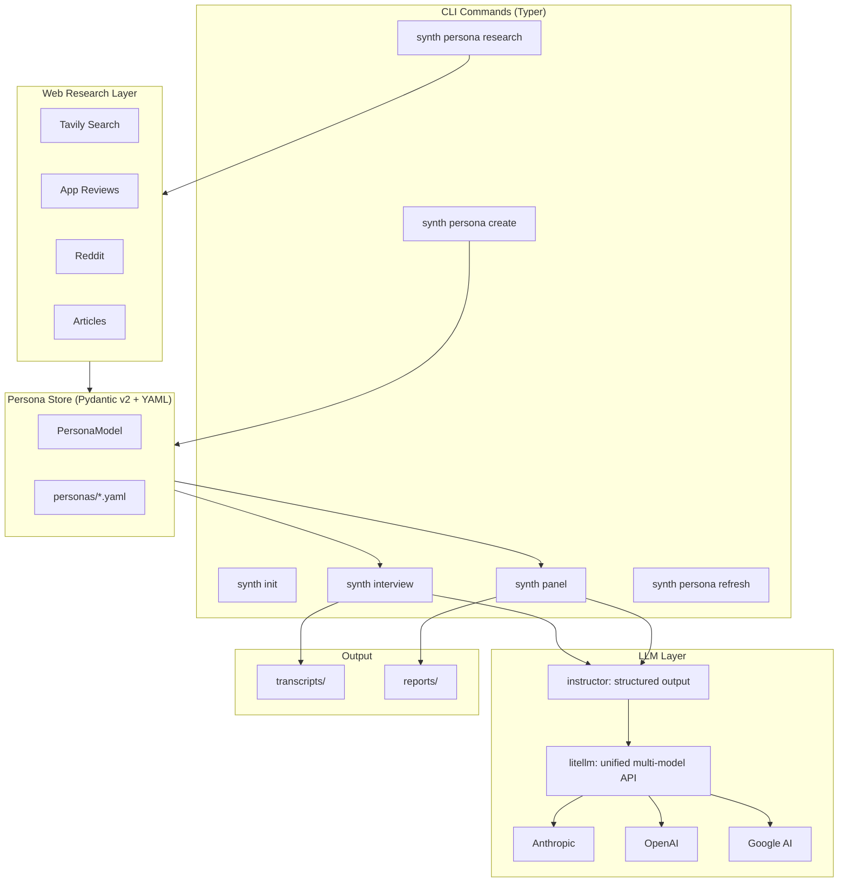

# synth-research

**AI-simulated user research that fights back against LLM sycophancy.**

Evidence-grounded personas. Multi-model replication. Adversarial review. Three layers of defense so your synthetic interviews produce hypotheses worth testing -- not flattery dressed up as insight.

[](https://github.com/bencalvert/synth-research/actions/workflows/ci.yaml)

---

## Why This Exists

LLMs can simulate user perspectives, but they systematically agree with you. Ask a simulated "frustrated admin" about your new feature and they'll find something nice to say about it. Run the same interview on three models and you'll get three flavors of agreement.

This is the [sycophancy problem](https://www.nngroup.com/articles/synthetic-users/). It makes naive synthetic research worse than useless -- it gives you false confidence.

`synth-research` treats this as a structural problem, not a prompting problem. It attacks sycophancy at three layers:

1. **Persona simulation controls** force pushback using the persona's own workarounds and skepticism patterns -- not generic "be honest" instructions
2. **Multi-model replication** runs the same interview on Claude, GPT-4o, and Gemini and flags where they diverge
3. **Devil's advocate pass** challenges every finding: "What obvious objections were never raised?"

The output isn't "insights." It's **confidence-tagged hypotheses** labeled SYNTHETIC, with clear guidance on what to validate with real users.

## Quick Start

Choose your entry point:

### Option 1: Claude Code or Cursor (no install, no API keys)

If you're already working inside Claude Code or Cursor, no setup is needed. The IDE provides the LLM and web search natively.

**Claude Code** — invoke as slash commands:
```
/synthetic-research:create-persona   # Build an evidence-grounded persona
/synthetic-research:interview        # Run a structured interview with a persona
/synthetic-research:panel            # Run a multi-persona panel
```

**Cursor** — the rule activates automatically when you open persona, transcript, or report files, or ask to run research. In Cursor 2.5+, multi-model panels dispatch Claude, GPT-4o, and Gemini as parallel subagents — no manual model-switching needed.

Output files (`personas/`, `transcripts/`, `reports/`) are fully compatible with the CLI, so you can mix both approaches freely.

---

### Option 2: CLI (full multi-model automation, CI-ready)

Requires API keys for each model provider and a web search provider. Enables fully automated parallel multi-model panels.

```bash
# Install with uv (recommended) or pip
uv pip install -e ".[dev]"

# Configure your models (reads API keys from env vars)
synth init

# Create your first evidence-grounded persona
synth persona create

# Run a synthetic interview
synth interview \
  --persona frustrated-admin \
  --mode problem-discovery \
  --topic "notification overload"

# Run a multi-persona, multi-model panel
synth panel \
  --personas admin,teacher,parent \
  --mode solution-feedback \
  --topic "consolidated notification feed" \
  --model-depth standard
```

| | Claude Code / Cursor | CLI |
|---|---|---|
| API keys required | None | Anthropic + web search provider |
| Install step | None | `uv pip install -e ".[dev]"` |
| Web search | Built-in (IDE native) | Tavily / SerpAPI / Brave |
| Multi-model panels | Parallel subagents (Cursor 2.5+) or single-model | Fully automated parallel dispatch |
| Best for | Interactive research sessions | Automation, CI, batch panels |

## What You Get

### Interview Transcript + Synthesis

Each interview produces a Markdown transcript with a structured synthesis:

```
## Synthesis

### Key Themes
1. Admin feels notification controls are buried in settings they never visit
2. Current workaround is a shared spreadsheet tracking which notifications to ignore

### Pushback Points
- "Every vendor says they support SSO. Half of them mean Google login."
- "Who's going to maintain this when I'm the only IT person?"

### Hypotheses
- **Admins will resist any solution that adds another admin console**
  [grounded, converged, unchallenged] -> accept
- **Teachers would adopt in-app notification preferences over email settings**
  [speculative, diverged, challenged] -> validate
```

### Panel Report

Multi-persona panels produce a report with a triage matrix, cross-model divergence analysis, and devil's advocate addendum:

```
| Persona       | Claude   | GPT-4o   | Agreement |
|---------------|----------|----------|-----------|
| Admin         | negative | negative | converged |
| Teacher       | mixed    | positive | diverged  |
| Parent        | positive | positive | converged |
```

When Claude and GPT-4o disagree about the same persona (Teacher, above), that's a signal -- not noise.

## Features

| Feature | What it does |
|---------|-------------|
| **IDE-native skills** | Claude Code slash commands + Cursor rule — no install or API keys needed |
| **Persona wizard** | Interactive creation with LLM-synthesized JTBD, simulation controls, and anti-sycophancy directives |
| **3-layer persona schema** | Stable identity (L1) / context & constraints (L2) / workflows & pain points (L3) |
| **Web research grounding** | Enriches personas with Reddit, app reviews, and articles (IDE: built-in search; CLI: Tavily/SerpAPI/Brave) |
| **Four interview modes** | Problem discovery, solution feedback, concept walkthrough, priority ranking |
| **Multi-model panels** | Same interview on Claude + GPT-4o + Gemini; parallel subagents in Cursor 2.5+, automated dispatch via CLI |
| **Devil's advocate** | Adversarial pass challenging sycophantic consensus and ideal-user assumptions |
| **Confidence tags** | Every finding tagged `[grounding, model_agreement, advocate_status]` |
| **Staleness detection** | Tracks `last_refreshed`, warns when personas need re-grounding |
| **Compatible outputs** | `personas/`, `transcripts/`, `reports/` shared between IDE skills and CLI |

## How the Panel Engine Works

```
personas/*.yaml ──> Interview Engine ──> Per-Model Synthesis ──> Cross-Model
                         |                                      Divergence
                    (persona x model)                            Analysis
                         |                                          |
                    Claude, GPT-4o,                                 v
                    Gemini (parallel)                   Devil's Advocate Pass
                                                                    |
                                                                    v
                                                    Confidence-Tagged Hypotheses
                                                                    |
                                                                    v
                                                         reports/*.md
```

1. **Load personas** -- YAML files with 3 behavioral layers + simulation controls
2. **Multi-model dispatch** -- Same interview runs on each configured model in parallel
3. **Per-model synthesis** -- Themes, surprises, and pushback points extracted per model
4. **Cross-model divergence** -- Where models disagree, the system flags it (not averages it)
5. **Devil's advocate** -- Adversarial review challenges smooth consensus, updates confidence tags
6. **Panel report** -- Triage matrix, convergent/divergent themes, blind spots, hypotheses

## Confidence Tags

Every hypothesis gets three dimensions:

| Dimension | Values | What it tells you |
|-----------|--------|-------------------|
| **Grounding** | `grounded` / `plausible` / `speculative` | Is there real evidence behind this? |
| **Model Agreement** | `converged` / `partial` / `diverged` | Did models agree, or is this model-specific? |
| **Advocate Status** | `unchallenged` / `challenged` | Did the devil's advocate flag it? |

**`[grounded, converged, unchallenged]`** -- safe to act on.
**`[speculative, diverged, challenged]`** -- validate with real users before building anything.

## Architecture



## Tech Stack

| Layer | Tool | Why |
|-------|------|-----|
| Language | **Python 3.12+** | Standard for AI/LLM tooling. Type hints throughout. |
| Package manager | **uv** | Rust-backed, 10-100x faster than pip. Replaces pip + poetry + pyenv. |
| CLI | **Typer** | Modern Click wrapper. Type-hinted args become CLI options automatically. |
| Terminal UX | **Rich** | Tables, markdown rendering, progress bars, interactive prompts. |
| Data models | **Pydantic v2** | Validated persona schemas. Structured LLM output parsing via `instructor`. |
| LLM routing | **litellm** | One API for 100+ models. Multi-model panels are one config change. |
| Structured output | **instructor** | `structured_complete(response_model=SynthesisReport)` returns validated Pydantic, not strings. |
| HTTP | **httpx** | Async-native. Powers the entire web research pipeline. |
| Search | **Tavily** | Search API with built-in content extraction. Also supports SerpAPI and Brave. |
| Lint + format | **ruff** | One Rust binary replaces black + flake8 + isort. |
| Type checking | **pyright** | Catches type errors at dev time. Excellent Pydantic v2 support. |
| Tests | **pytest** + **pytest-asyncio** | Structural validation, evidence traceability, behavioral evals. |
| CI | **GitHub Actions** | Lint, type-check, test on every push. |

## The Anti-Sycophancy Problem (and How This Solves It)

LLM-simulated users systematically over-estimate enthusiasm and under-estimate friction. This isn't a bug in one model -- it's a structural property of RLHF-trained language models ([NN/g](https://www.nngroup.com/articles/synthetic-users/), [CHI 2025](https://arxiv.org/abs/2601.22288)).

Three prompting tricks can't fix a structural problem. Three structural defenses can:

**Layer 1: Persona Simulation Controls**
Each persona has anti-sycophancy directives that reference *their specific* context:
```yaml
anti_sycophancy_directives:
  - "I already do rostering through Clever. If your integration actually works, great.
     If it's another CSV upload pretending to be automated, no thanks."
  - "Every vendor says they support SSO. Half of them mean Google login."
  - "Who's going to maintain this when I'm the only IT person?"
```

These aren't generic ("be honest"). They're grounded in the persona's workarounds, tools, and pain points.

**Layer 2: Multi-Model Replication**
Running on Claude alone gives you Claude's biases. Running on Claude + GPT-4o + Gemini gives you *disagreement as signal*. When models converge, confidence goes up. When they diverge, you know where to dig deeper.

**Layer 3: Devil's Advocate**
After synthesis, an adversarial pass reviews every finding:
- "Did personas agree too easily?"
- "What switching costs were never mentioned?"
- "Does this assume a motivated, tech-savvy user?"

Findings that survive all three layers get tagged `unchallenged`. The rest get tagged `challenged` with specific reasons.

## Project Structure

```
src/synth/
  cli.py                    # Typer entry point
  commands/                 # init, persona, interview, panel
  models/                   # Pydantic v2: PersonaModel, SynthesisReport, ConfidenceTag
  core/                     # LLM wrapper, interview engine, panel runner, advocate
  research/                 # Web search, Reddit, app reviews, article extraction
  wizard/                   # Guided persona creation
tests/                      # Schema validation, evidence traceability, advocate logic
personas/                   # Your persona YAML files
transcripts/                # Saved interview transcripts
reports/                    # Saved panel reports
```

## License

MIT
