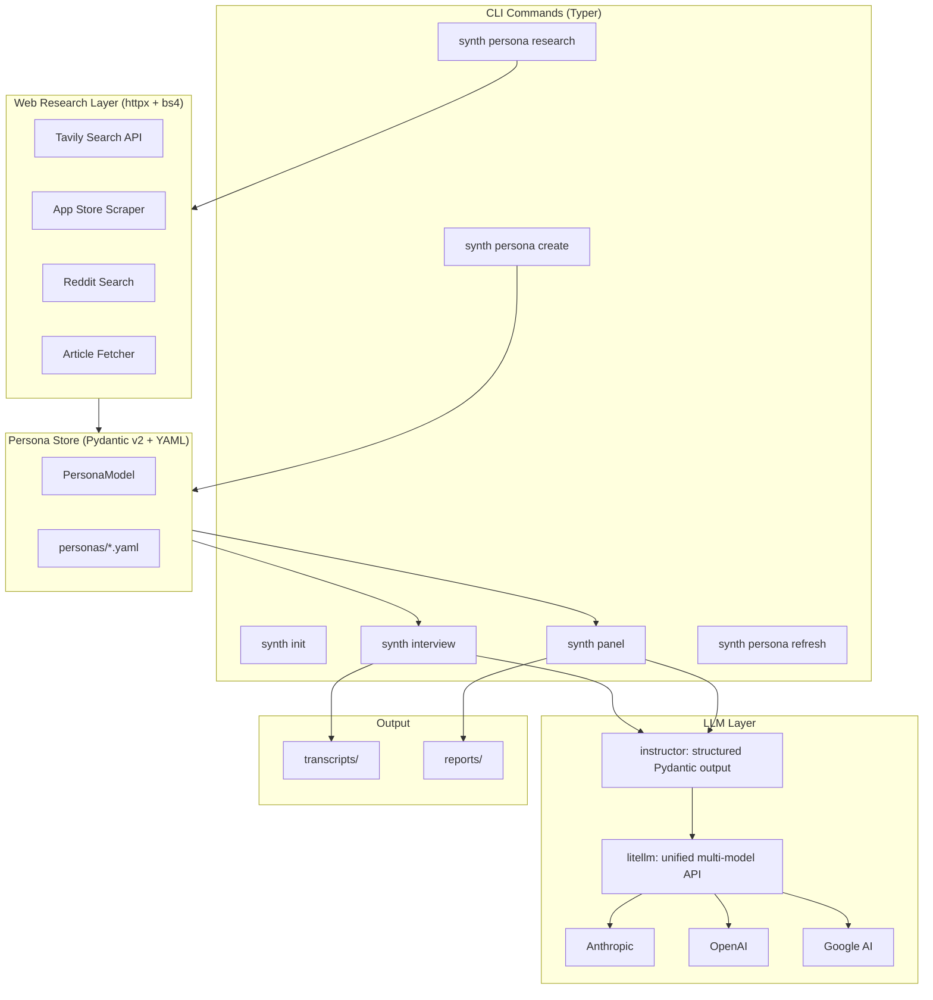

# synth-research

AI-simulated user research with evidence-grounded personas, multi-model replication, and anti-sycophancy defenses.

[](https://github.com/bencalvert/synth-research/actions/workflows/ci.yaml)

## The Problem

LLMs can simulate user perspectives, but they systematically agree with you. They smooth over objections, compress nuance, and produce suspiciously enthusiastic feedback. This tool fixes that with **evidence-grounded personas**, **multi-model replication**, and **adversarial review** -- three layers of defense against synthetic sycophancy.

## Quick Start

```bash
# Install
uv pip install -e ".[dev]"

# Configure models and API keys
synth init

# Create your first persona
synth persona create

# Run a synthetic interview
synth interview --persona my-persona --mode problem-discovery --topic "onboarding flow"

# Run a multi-persona, multi-model panel
synth panel --personas persona-a,persona-b --mode solution-feedback --topic "new dashboard feature"
```

## Features

- **Guided persona wizard** -- Interactive creation with LLM-synthesized JTBD, simulation controls, and anti-sycophancy directives
- **3-layer persona schema** -- Stable identity (Layer 1), context/constraints (Layer 2), workflows/pain-points that update regularly (Layer 3)
- **Web research grounding** -- Enriches personas with Reddit threads, app reviews, and articles via Tavily/SerpAPI/Brave
- **Four interview modes** -- Problem discovery, solution feedback, concept walkthrough, priority ranking
- **Multi-model panels** -- Run the same interview on Claude, GPT-4o, and Gemini, then compare for model-specific bias
- **Devil's advocate pass** -- Adversarial review that challenges smooth consensus, catches missing objections, and flags ideal-user assumptions
- **3-dimensional confidence tags** -- Every finding tagged with `[grounding, model_agreement, advocate_status]`
- **Persona staleness detection** -- Tracks `last_refreshed` and warns when personas need updating

## Architecture



## How It Works

### Panel Flow

1. **Load personas** -- Each persona is a YAML file with 3 layers of behavioral data plus simulation controls
2. **Multi-model dispatch** -- The same interview runs on each configured model (e.g., Claude + GPT-4o)
3. **Per-model synthesis** -- Themes, surprises, and pushback points extracted per model
4. **Cross-model divergence** -- Where models disagree about the same persona, the system flags it as a potential sycophancy artifact
5. **Devil's advocate** -- An adversarial pass challenges smooth consensus and updates confidence tags
6. **Panel report** -- Triage matrix, convergent/divergent themes, confidence-tagged hypotheses

### Confidence Tags

Every hypothesis gets three dimensions:

| Dimension | Values | Meaning |
|-----------|--------|---------|
| **Grounding** | grounded, plausible, speculative | How well-evidenced is this? |
| **Model Agreement** | converged, partial, diverged | Did models agree? |
| **Advocate Status** | challenged, unchallenged | Did the devil's advocate flag it? |

A hypothesis tagged `[grounded, converged, unchallenged]` is safe to act on. One tagged `[speculative, diverged, challenged]` needs real-user validation.

## Tech Stack

| Layer | Tool | Why |
|-------|------|-----|
| Language | **Python 3.12+** | Standard for AI/LLM tooling |
| Package management | **uv** | Rust-backed, 10-100x faster than pip |
| CLI framework | **Typer** | Modern Click wrapper with type hints |
| Terminal UX | **Rich** | Tables, markdown, progress bars, prompts |
| Data models | **Pydantic v2** | Validated schemas, structured LLM output |
| LLM routing | **litellm** | Unified API for 100+ models |
| Structured output | **instructor** | Forces Pydantic model responses from any LLM |
| HTTP | **httpx** | Async-native HTTP client |
| Web scraping | **beautifulsoup4** | HTML parsing for content extraction |
| Web search | **Tavily** | Search API with content extraction |
| Linting | **ruff** | Replaces black + flake8 + isort |
| Type checking | **pyright** | Excellent Pydantic v2 support |
| Tests | **pytest** | With pytest-asyncio for async support |

## Anti-Sycophancy Design

LLMs systematically smooth, flatter, and compress conflicting viewpoints. This tool addresses that at three layers:

1. **Persona-level simulation controls** -- Each persona has specific directives that instruct pushback, skepticism, and anti-agreement behavior. These aren't generic ("be honest") -- they reference the persona's actual workarounds, tools, and pain points.

2. **Multi-model replication** -- Running the same interview on Claude, GPT-4o, and Gemini catches model-specific bias. When models diverge on the same persona, that's a signal to investigate rather than average.

3. **Devil's advocate pass** -- After synthesis, an adversarial review challenges every theme: "What would make a real user push back?" "What obvious objections were never raised?" "Does this assume an ideal user?"

This mirrors the approach recommended by [Nielsen Norman Group's research on synthetic users](https://www.nngroup.com/articles/synthetic-users/) and findings from [CHI 2025](https://arxiv.org/abs/2601.22288) on LLM-simulated personas.

## License

MIT
